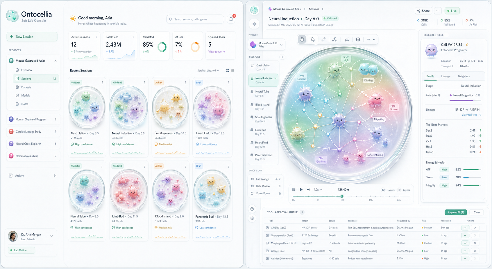

<div align="center">

# Ontocellia

**Grow task-induced agent tissues from a single stem cell.**

<em>🧫 One task becomes a culture medium. 🧬 One origin cell becomes a working tissue.</em>

<p>
  <a href="docs/usage.md"></a>
  
  
  
</p>



<p>
  <sub><strong>Concept visualization</strong> · Soft Lab Console for live agent-tissue sessions.</sub>
</p>

</div>

## 🧫 Concept

Ontocellia treats multi-agent collaboration as a living tissue rather than a fixed agent graph. A task becomes the culture medium: one stem-origin cell proliferates, differentiates into specialized cells, communicates through an extracellular matrix, and adapts under bounded feedback.

The framework is built around a biological metaphor with practical engineering boundaries: genes express tendencies, cells keep local context, the matrix stores shared evidence, morphogens shape task pressure, organ selection provides weak global feedback, and extracellular interfaces gate tool use.

```text
task / culture medium
-> single stem-origin cell
-> proliferation and differentiation
-> tissue communication and matrix memory
-> policy-gated action intents and feedback
```

## ✨ Highlights

| Layer | Role |
| --- | --- |
| **🧬 Genome** | Encodes endogenous gene programs, expression bias, mutation history, and validation hooks. |
| **🧫 Cell** | Tracks fate, stage, lineage, receptors, adhesion, energy, and local history. |
| **🌱 Developmental field** | Uses morphogens, graph topology, and fate attractors to shape tissue structure. |
| **🕸️ Matrix memory** | Keeps shared evidence, messages, handoffs, corrections, and execution feedback. |
| **🔬 Extracellular tools** | Routes intents through explicit receptor, environment, and policy gates. |

## 🚀 Quick Start

```bash
conda env create -f environment.yml
conda activate ontocellia
python -m ontocellia
```

## 🗺️ Explore

- [Usage](docs/usage.md)
- [Framework](docs/framework.md)
- [Architecture](docs/architecture.md)
- [Design document](docs/agent-tissue-design.md)
- [Web Lab concept](docs/web-lab-design.md)
- [Roadmap](docs/roadmap.md)

## 🛠️ Development

```bash
python -m pytest -q
```
